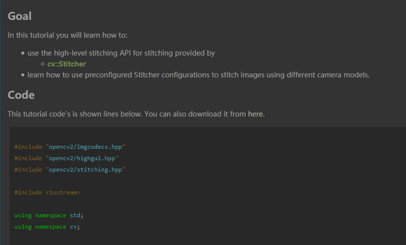

# Random Pieces

## bashrc/zshrc
Current user's config file: `~/.bashrc` for bash, `~/.zshrc` for zsh.

System level (pre-load before each user's own) config file: `/etc/profile` for bash, `/etc/zsh/zshrc` for zsh.

- Change `PATH`: affect executable files' finding path order.
    - prepend: `export PATH=/some/path:$PATH`
    - append: `export PATH=$PATH:/some`

- Change `LD_LIBRARY_PATH`: affect shared library's finding path order.
    - prepend: `export LD_LIBRARY_PATH=/some/path:$LD_LIBRARY_PATH`
    - append: `export LD_LIBRARY_PATH=$LD_LIBRARY_PATH:/some/path`

- Chage `PYTHONPATH`: affect python library finding path order.
    - recommended: set `PYTHONPATH` begin/ends with seperator
      - Win: `;`
      - Linux/MacOS: `:`
    - the begin-with / end-with seperator makes "the folder where we invoke python" `sys.path[1]`, make life easier (e.g. VSCode Python debug a DeepLearing project)

For multiple version of same software tool (e.g. nvcc/cuda/cmake/ctags/vim, or python package), we can switching them via change `PATH`(for executables) and `LD_LIBRARY_PATH`(for dynamic libraries). Remember to source config file, or re-login a new shell.


## terminator

On Ubuntu, use **terminator** when you miss iterm2 of MacOS. It's for window spliting. To install:
```bash
sudo apt install terminator
```

Its default looking is wired to me, to make it the same looking as gnome-terminal, edit file `~/.config/terminator/config` and fill in with:
```config
[global_config]
  title_font = Ubuntu Mono 11[keybindings]
[layouts]
  [[default]]
    [[[child1]]]
      parent = window0
      type = Terminal
    [[[window0]]]
      parent = ""
      type = Window
[plugins]
[profiles]
  [[default]]
    background_color = "#002b36"
    background_darkness = 0.91
    background_image = None
    background_type = transparent
    cursor_blink = False
    cursor_shape = ibeam
    font = Ubuntu Mono 11
    foreground_color = "#e0f0f1"
    use_system_font = False
    show_titlebar = False
```

You can also copy from [mine](home/.config/terminator/config) in this repo.


## tmux
tmux is for
- window spliting
- can re-connected session


We can use tmux on both Linux & MacOS. Install it on Ubuntu:
```bash
sudo apt install tmux
```

The default tmux Ctrl-B binding, the not enabled mouse scrooling, the wired window spliting keys, and more settings, all can be re-configured by editing `~/.tmux.conf` file:

```bash
set -g prefix C-v

#########################
#
# turn on mouse
#
#########################
# if tmux version < 2.1
#setw -g mouse-resize-pane on
#setw -g mouse-select-pane on
#setw -g mouse-select-window on
#setw -g mode-mouse on

# if tmux version >= 2.1
set -g mouse on

# split window
unbind '"'
# vertical split (prefix -)
bind - splitw -v
unbind '%'
bind | splitw -h # horizontal split (prefix |)
```

You can also copy from [.tmux.conf](mine/.tmux.conf) in this repo.

## vim
vim can be used on Linux, MacOS and Windows(git bash).

Config with the following command

```bash
git clone https://github.com/zchrissirhcz/dotvim ~/.vim_runtime
sh ~/.vim_runtime/install_awesome_vimrc.sh
```

which, will create the entry point of vim in:
- `/home/xx/.vimrc` for Linux
- `/Users/xx/.vimrc` for MacOSX
- `C:/Users/xx/.vimrc` for Windows

## ag
`ag` is the silver-searcher, a replacement for `grep`.

- Windows:
downlowd from [here](https://github.com/k-takata/the_silver_searcher-win32/releases) and put `ag.exe` in folder that in `PATH` env variable. I recommend `e:/soft/Git/usr/bin` folder.


## binary/hex view
- Vim
  ```vimscript
  :%!xxd
  ```

- Ubuntu
  ```bash
  sudo apt install hexedit
  ```

- Windows GitBash
  Download [HxD](https://mh-nexus.de/downloads/HxDchs.zip) and add to `PATH`.


## tree
- Ubuntu
  ```bash
  sudo apt install tree
  ```

- Windows GitBash
  - Install [GitBash Dev](https://github.com/git-for-windows/build-extra/releases/download/git-sdk-1.0.7/git-sdk-installer-1.0.7-64.7z.exe) and run `Pacman -S tree`
  - Or, download [prebuilt tree.exe](https://sourceforge.net/projects/gnuwin32/files/tree/1.5.2.2/tree-1.5.2.2-bin.zip/download) and put it to `d:/soft/Git/bin/`


## Doxygen Dark Theme
For doxygen docs (e.g. OpenCV), backup root folder's `stylesheet.css` and replace with [stylesheet.css](home/doxygen/stylesheet.css), inspired and modified by [ref](https://userstyles.org/styles/128500/doxygen-dark).




## gdb
Config it in file `~/.gdbinit`. Mine is [here](home/.gdbinit), minor custom based on [Gdbinit](https://github.com/gdbinit/Gdbinit). You may also refer to excellent gdb config projects like [peda](https://github.com/longld/peda) and [gef](https://github.com/hugsy/gef).

## cgdb
Using gdb with terminal GUI, displaying the corresponding code line.

Until 0.7.0, cgdb support split window vertically. Built it from scratch, in Ubuntu16.04:
```bash
sudo apt install autoconf automake gcc g++
sudo apt-get install libncurses5-dev flex texinfo libreadline-dev

cd ~/work
git clone https://github.com/cgdb/cgdb
cd cgdb
./autogen.sh
mkdir build
cd build
../configure --prefix=/usr/local/cgdb
make -j2
sudo make install
```

Usage:
```bash
gcc -g main.c
cgdb ./a.out
```

cgdb can be customized `~/.cgdb/cgdbrc`, mine is [here](home/.cgdb/cgdbrc)


## bat
```bash
#--- bincat: cat 的替代，输出带颜色和行号
# 官网： https://github.com/sharkdp/bat
# 中文文档： https://github.com/chinanf-boy/bat-zh
sudo apt install bat
# alias bat='batcat'
```

## terminal-emulators 终端模拟器

Tabby 不错的样子， 好看， 支持分屏， 支持 Linux/Windows/Mac

https://github.com/Eugeny/tabby/releases/tag/v1.0.159


## gitlint
```bash
pip install gitlint
```
Then puth .gitlint in repo root directory and call `gitlint install-hook`


## zsh启动慢怎么办？
- 去掉 conda 的启动，改为添加conda/bin到PATH
- https://zhuanlan.zhihu.com/p/68303393
- https://zhuanlan.zhihu.com/p/98450570

## References
- [MaskRay's Config](https://github.com/MaskRay/Config)
- [zsh-users/zsh-completions](https://github.com/zsh-users/zsh-completions)
