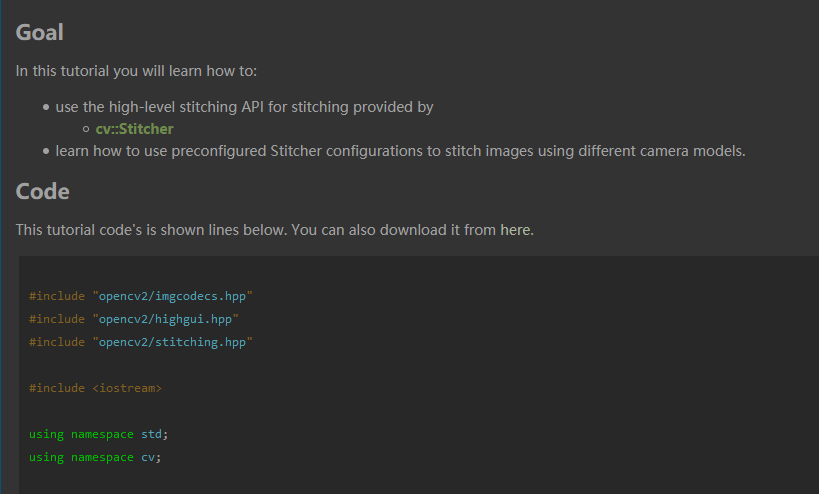

# dotfiles
Zhuo's Personal dotfiles for environtment settings.

## bashrc/zshrc
Current user's config file: `~/.bashrc` for bash, `~/.zshrc` for zsh.

System level (pre-load before each user's own) config file: `/etc/profile` for bash, `/etc/zsh/zshrc` for zsh.

- Change `PATH`: affect executable files' finding path order.
    - prepend: `export PATH=/some/path:$PATH`
    - append: `export PATH=$PATH:/some`

- Change `LD_LIBRARY_PATH`: affect shared library's finding path order.
    - prepend: `export LD_LIBRARY_PATH=/some/path:$LD_LIBRARY_PATH`
    - append: `export LD_LIBRARY_PATH=$LD_LIBRARY_PATH:/some/path`

- Chage `PYTHONPATH`: affect python library finding path order.
    - recommended: set `PYTHONPATH` begin/ends with seperator
      - Win: `;`
      - Linux/MacOS: `:`
    - the begin-with / end-with seperator makes "the folder where we invoke python" `sys.path[1]`, make life easier (e.g. VSCode Python debug a DeepLearing project)

For multiple version of same software tool (e.g. nvcc/cuda/cmake/ctags/vim, or python package), we can switching them via change `PATH`(for executables) and `LD_LIBRARY_PATH`(for dynamic libraries). Remember to source config file, or re-login a new shell.


## terminator

On Ubuntu, use **terminator** when you miss iterm2 of MacOS. It's for window spliting. To install:
```bash
sudo apt install terminator
```

Its default looking is wired to me, to make it the same looking as gnome-terminal, edit file `~/.config/terminator/config` and fill in with:
```config
[global_config]
  title_font = Ubuntu Mono 11[keybindings]
[layouts]
  [[default]]
    [[[child1]]]
      parent = window0
      type = Terminal
    [[[window0]]]
      parent = ""
      type = Window
[plugins]
[profiles]
  [[default]]
    background_color = "#002b36"
    background_darkness = 0.91
    background_image = None
    background_type = transparent
    cursor_blink = False
    cursor_shape = ibeam
    font = Ubuntu Mono 11
    foreground_color = "#e0f0f1"
    use_system_font = False
    show_titlebar = False
```

You can also copy from [config](configs/.config/terminator/config) in this repo.

## git

git is for flexibly source code version control. Can be use on Windows/Linux/MacOS.

Let's use git with customed config:

```
#--- proxy
[http]
    #proxy = http://127.0.0.1:44099

#--- diff & merge
# when do git difftool with vimdiff, exit with :cq
[difftool]
	trustExitCode = true
[mergetool]
	trustExitCode = true
[diff]
	tool = meld

#--- aliases
[alias]
    co = checkout
    ci = commit
    st = status
    br = branch
    hist = log --pretty=format:'%h %ad | %s%d [%an]' --graph --date=short
    type = cat-file -t
    dump = cat-file -p

#--- commit hint message
[commit]
    template = ~/.gitmessage
```

You can also copy from [.gitmessage](configs/.gitconfig) and [.gitmessage](configs/.gitmessage) in this repo.


## tmux
tmux is for
- window spliting
- can re-connected session


We can use tmux on both Linux & MacOS. Install it on Ubuntu:
```bash
sudo apt install tmux
```

The default tmux Ctrl-B binding, the not enabled mouse scrooling, the wired window spliting keys, and more settings, all can be re-configured by editing `~/.tmux.conf` file:

```
set -g prefix C-v

#########################
#
# turn on mouse
#
#########################
# if tmux version < 2.1
#setw -g mouse-resize-pane on
#setw -g mouse-select-pane on
#setw -g mouse-select-window on
#setw -g mode-mouse on

# if tmux version >= 2.1
set -g mouse on

# split window
unbind '"'
# vertical split (prefix -)
bind - splitw -v
unbind '%'
bind | splitw -h # horizontal split (prefix |)
```

You can also copy from [.tmux.conf](configs/.tmux.conf) in this repo.

## vim
vim can be used on Linux, MacOS and Windows(git bash).

Config with the following command

```bash
git clone https://github.com/zchrissirhcz/dotvim ~/.vim_runtime
sh ~/.vim_runtime/install_awesome_vimrc.sh
```

which, will create the entry point of vim in:
- `/home/xx/.vimrc` for Linux
- `/Users/xx/.vimrc` for MacOSX
- `C:/Users/xx/.vimrc` for Windows

## ag
`ag` is the silver-searcher, a replacement for `grep`.

- Windows:
downlowd from [here](https://github.com/k-takata/the_silver_searcher-win32/releases) and put `ag.exe` in folder that in `PATH` env variable. I recommend `e:/soft/Git/usr/bin` folder.

- Linux:
```bash
sudo apt install silversearcher_ag
```

## binary/hex view
- Vim
  ```vimscript
  :%!xxd
  ```

- Ubuntu
  ```bash
  sudo apt install hexedit
  ```

- Windows GitBash
  Download [HxD](https://mh-nexus.de/downloads/HxDchs.zip) and add to `PATH`.


## tree
- Ubuntu
  ```bash
  sudo apt install tree
  ```

- Windows GitBash
  - Install [GitBash Dev](https://github.com/git-for-windows/build-extra/releases/download/git-sdk-1.0.7/git-sdk-installer-1.0.7-64.7z.exe) and run `Pacman -S tree`
  - Or, download [prebuilt tree.exe](https://sourceforge.net/projects/gnuwin32/files/tree/1.5.2.2/tree-1.5.2.2-bin.zip/download) and put it to `d:/soft/Git/bin/`

## EditorConfig
Based on OpenCV's editorconfig setting, with minor change. Just copy them and saved as `.editorconfig` in root directory of your project:

```bash
# https://editorconfig.org/

root = true

[*]
##end_of_line = lf
charset = utf-8
insert_final_newline = true
indent_style = space
indent_size = 4

[{CMakeLists.*,*.cmake}]
indent_style = space
indent_size = 2

[Makefile]
indent_style = tab

[*.{bat,cmd,cmd.*}]
end_of_line = crlf
indent_style = space
indent_size = 2

[*.{ps1,ps1.*}]
end_of_line = crlf
indent_style = space
indent_size = 4

[*.{md,markdown}]
indent_size = 2
```


## Doxygen Dark Theme
For doxygen docs (e.g. OpenCV), backup root folder's `stylesheet.css` and replace with [stylesheet.css](config/doxygen/stylesheet.css), inspired and modified by [ref](https://userstyles.org/styles/128500/doxygen-dark).




## cgdb
Using gdb with terminal GUI, displaying the corresponding code line.

Usage:
```bash
gcc -g main.c
cgdb ./a.out
```

cgdb can be customized `~/.cgdb/cgdbrc`, mine is [here](configs/.cgdb/cgdbrc)

